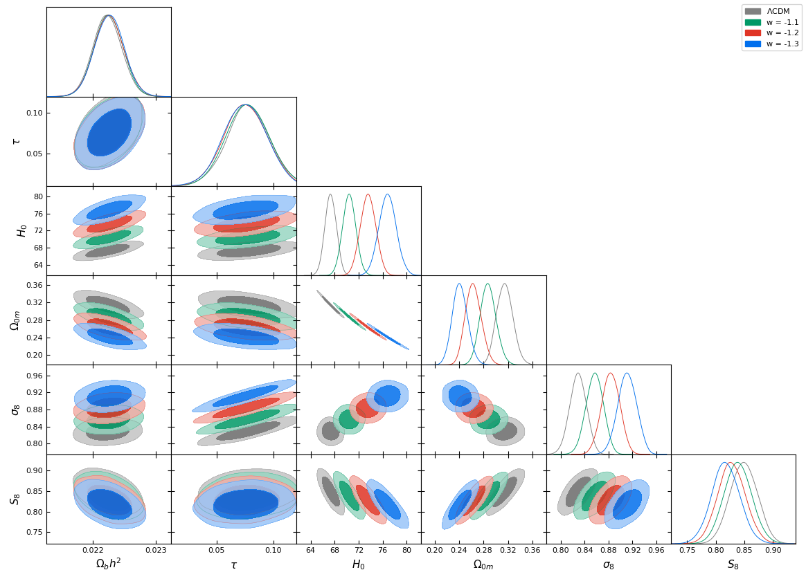

# H0 Tension, Phantom Dark Energy and Cosmological Parameter Degeneracies

## Abstract 
Dark energy with equation of state parameter  can produce amplified cosmic acceleration at late times, thus increasing the value of  favoured by CMB data and releasing the tension with local measurements of . In order to demonstrate this hypothesis, we show that the best fit value of  in the context of the CMB power spectrum is degenerate with a constant equation of state parameter !,  in accordance with the approximate effective linear equation  which is accurate in the range ![$w\in \[-1.5,-1\]$](https://render.githubusercontent.com/render/math?math=%24w%5Cin%20%5B-1.5%2C-1%5D%24) with  in . This equation is derived by assuming that both  and the co-moving angular diameter distance to the last scattering  surface %7D%24) remain constant and equal to their best fit Planck/CDM values as ,  and  vary.  This  secures that the predicted CMB spectrum remains practically unchanged and equal to its best fit CDM form.  For  (CDM), this linear degeneracy equation leads to the best fit   as expected. For  the corresponding predicted CMB best fit Hubble constant is    which is identical with the value obtained  by local distance ladder measurements, therefore leading to an apparent resolution of the Hubble tension. We verify the above  degeneracy equation by fitting a CDM model with fixed values of  to the Planck data and show that the above linear degeneracy equation is accurate to within less than  in the range ![$w\in \[-1.5,-1\]$](https://render.githubusercontent.com/render/math?math=%24w%5Cin%20%5B-1.5%2C-1%5D%24), while the quality of fit to the Planck data remains practically unchanged in the parameter region. The value of  needed for an apparent resolution of the  tension (best fit ), also leads to a reduced best fit value of . This apparent resolution of the  tension however is not viable since the quality of fit of these parametrizations to other cosmological data including growth data, SnIa and BAO is worse than that of CDM. Finally we show how these results can be extended in the case of an evolving equation of state parameter %24) leading to degenerate regions in the parameter space of parameters appearing in the form of %24) where the predicted CMB power spectrum remains practically invariant. We analyse in detail this degeneracy for the parametrization %3Dw0%2Bw1%20z%2F(1%2Bz)%24) and identify analytically  the full %24) parameter region that leads to a best fit   in the context of the Planck CMB spectrum.

## Citing the paper 
If you use any of the above codes or the figures in a published work please cite the following paper:
 *H0 Tension, Phantom Dark Energy and Cosmological Parameter Degeneracies*
 George Alestas, Lavrentios Kazantzidis and Leandros Perivolaropoulos

Any further questions/comments are welcome

## Authors List
George Alestas - <g.alestas@uoi.gr>
 Lavrentios Kazantzidis - <l.kazantzidis@uoi.gr>
 Leandros Perivolaropoulos - <leandros@uoi.gr>
